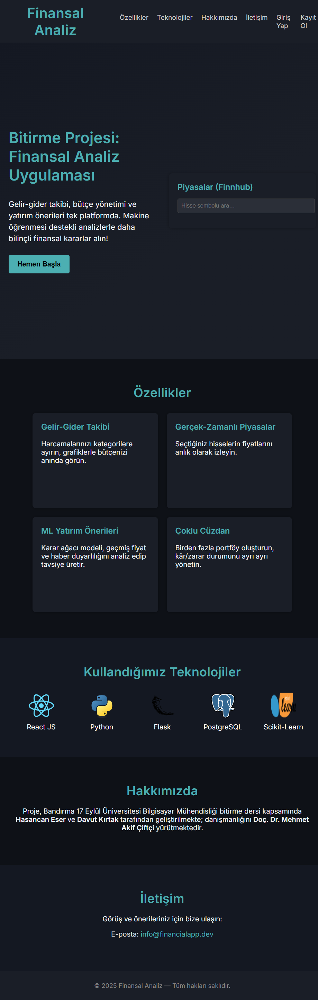
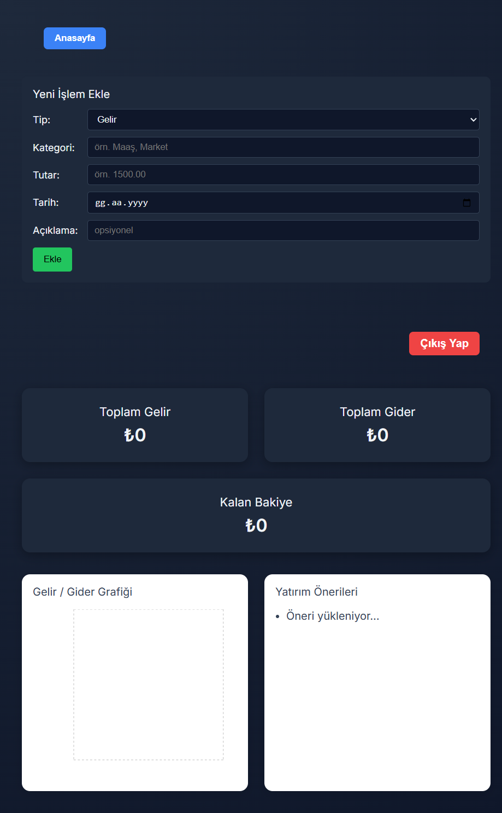
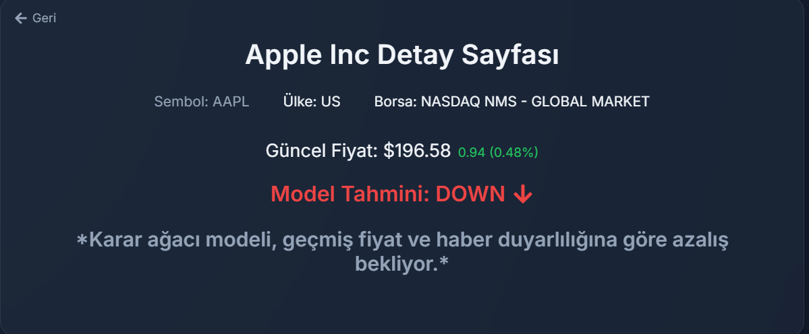

<div align="center">

# 📊 Finansal Analiz Uygulaması

<sup>Bandırma Onyedi Eylül Üniversitesi – Bilgisayar Mühendisliği Bitirme Projesi (2025)</sup>

</div>

---

## İçindekiler

* [Proje Hakkında](#proje-hakkında)
* [Ekran Görüntüleri](#ekran-görüntüleri)
* [Özellikler](#özellikler)
* [Mimari](#mimari)
* [Kullanılan Teknolojiler](#kullanılan-teknolojiler)
* [API Uç Noktaları](#api-uç-noktaları)
* [Yol Haritası](#yol-haritası)
* [Katkıda Bulunanlar](#katkıda-bulunanlar)

---

## Proje Hakkında

**Finansal Analiz Uygulaması**, kişisel finans yönetimi ile temel yatırım analizini tek bir platformda birleştiren açık kaynaklı bir web uygulamasıdır.

Kullanıcılar:

1. **Gelir–gider** kalemlerini kaydederek bütçelerini takip eder.
2. **Finnhub** üzerinden gerçek zamanlı hisse verisi sorgular.
3. Basit bir **Decision Tree** modeli ile “yarın yükselir / düşer” öngörüsü alır.

> **Takım Üyeleri**
> • Hasancan Eser   • Davut Kırtak
> **Danışman** Doç. Dr. Mehmet Akif Çiftçi

---

## Ekran Görüntüleri

| Landing                      | Dashboard                        | Market Detail              |
| ---------------------------- | -------------------------------- | -------------------------- |
|  |  |  |

---

## Özellikler

* 🔑 JWT tabanlı kimlik doğrulama
* 📈 Gelir / gider grafikleri (Recharts)
* 🌐 Finnhub sembol arama + canlı fiyat
* 🤖 `DecisionTreeClassifier` ile fiyat yönü tahmini
* 🗃️ PostgreSQL üzerinde kategori, işlem & portföy tabloları

---

## Mimari

```text
┌────────────┐       REST        ┌──────────────┐        SQL         ┌────────────┐
|  React UI  | ───────────────▶ |  Flask  API  | ────────────────▶  | PostgreSQL |
└────────────┘                  └──────────────┘                     └────────────┘
        ▲                              │
        │  Websocket (dev hot-reload)  ▼
        └──────── Finnhub + ML  ◀─────┘
```

---

## Kullanılan Teknolojiler

| Katman          | Teknoloji                                 |
| --------------- | ----------------------------------------- |
| **Frontend**    | React 18, React-Router v6                 |
| **Backend**     | Flask 2.x, Flask-JWT-Extended, Flask-CORS |
| **Veritabanı**  | PostgreSQL 15, SQLAlchemy ORM             |
| **Makine Öğr.** | Scikit-Learn, Pandas, yfinance            |
| **3rd Party**   | Finnhub API, News API (opsiyonel)         |

---

## API Uç Noktaları

| Metot | Yol                         | Açıklama                  |
| ----- | --------------------------- | ------------------------- |
| POST  | `/api/auth/register`        | Kullanıcı kaydı           |
| POST  | `/api/auth/login`           | Giriş & JWT               |
| GET   | `/api/transactions/summary` | Gelir/gider toplamları    |
| GET   | `/api/transactions/history` | Aylık akış grafiği verisi |
| POST  | `/api/transactions/`        | Yeni finansal işlem       |
| GET   | `/api/predict/<symbol>`     | Hisse fiyat yönü tahmini  |

---

## Yol Haritası

* [ ] LSTM / Transformer tabanlı zaman serisi modeli
* [ ] Kripto & döviz entegrasyonu
* [ ] React Native mobil uygulaması
* [ ] AWS Fargate otomatik ölçeklendirme

---

## Katkıda Bulunanlar

| Rol                | İsim                        |
| ------------------ | --------------------------- |
| **Full-Stack Dev** | Hasancan Eser               |
| **ML & Back-End**  | Davut Kırtak                |
| **Danışman**       | Doç. Dr. Mehmet Akif Çiftçi |

---

<!-- README sonu -->
